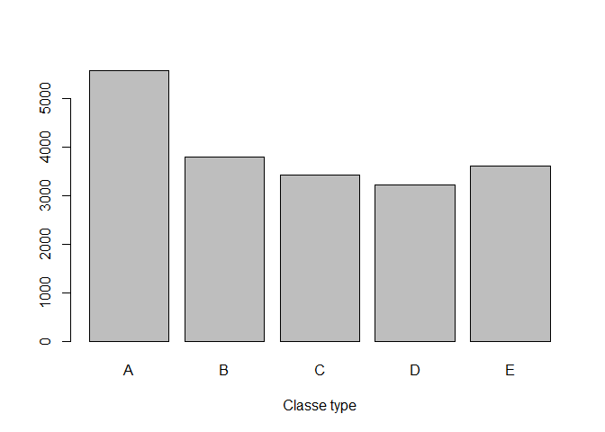
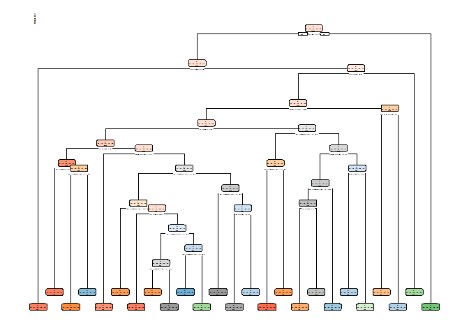

Summary
=======

One thing that people regularly do is quantify how much of a particular activity they do, but they rarely quantify how well they do it. In this project, the goal will be to use data from accelerometers on the belt, forearm, arm, and dumbell of 6 participants to predict the manner in which they did the exercise.

We are going to predict is the "classe" variable using any of the other variables that describe performance.

This report describe how the model where build, how we used cross validation, what we think about the expected out of sample error is, and why we made this choices. We will also use your prediction model to predict 20 different test cases.

0-Packages
----------

``` r
library(caret)
```

    ## Loading required package: lattice

    ## Loading required package: ggplot2

    ## Warning: package 'ggplot2' was built under R version 3.3.3

``` r
library(knitr)
library(rpart)
library(randomForest)
```

    ## Warning: package 'randomForest' was built under R version 3.3.3

    ## randomForest 4.6-12

    ## Type rfNews() to see new features/changes/bug fixes.

    ## 
    ## Attaching package: 'randomForest'

    ## The following object is masked from 'package:ggplot2':
    ## 
    ##     margin

``` r
set.seed(12345)
```

1-Data
------

The data for this project come from this source: <http://groupware.les.inf.puc-rio.br/har>.

The data base include 160 variables, which are: The classe variable wich have 5 categories (A,B,C,D,E) and a group of continuous variables that record the user preformance in different aspects.

Class A corresponds to the specified execution of the exercise, while the other 4 classes correspond to common mistakes. Participants were supervised by an experienced weight lifter to make sure the execution complied to the manner they were supposed to simulate. The exercises were performed by six male participants aged between 20-28 years, with little weight lifting experience, all participants could easily simulate the mistakes in a safe and controlled manner by using a relatively light dumbbell (1.25kg).

*Exactly according to the specification (Class A), *Throwing the elbows to the front (Class B), *Lifting the dumbbell only halfway (Class C), *lowering the dumbbell only halfway (Class D), \*Throwing the hips to the front (Class E).

Read more: <http://groupware.les.inf.puc-rio.br/har#ixzz4cLuKQXrW>

``` r
training <-read.csv("C:/Users/AndreinaDeJ/Documents/Andreina Torres/Academico/coursera/cursos y cursera/Coursera/data scientits specialization/8-Practical machine learning/assigment/pml-training.csv",na.strings = c("NA","#DIV/0!",""))
testing <-read.csv("C:/Users/AndreinaDeJ/Documents/Andreina Torres/Academico/coursera/cursos y cursera/Coursera/data scientits specialization/8-Practical machine learning/assigment/pml-testing.csv",na.strings = c("NA","#DIV/0!",""))
```

2-Data cleaning
---------------

We create a new data set that contains the variables that will be used in the model. Therefore, the following variables were removed: variables without variance, variables with more that a 50% of records with missing values, unnecessary variables.

``` r
#Delete variables without variance
nzv <- nearZeroVar(training, saveMetrics=TRUE)
training2 <- training[,nzv$nzv==FALSE]

#Delete users names (unnecessary) 
training2 <- training2[,-c(1,2,5)]
#training2<-training2[,-c(1,4)]

#Delete less than 50% missings
training2 <- training2[colSums(is.na(training2))/nrow(training2) < .5]


#keep the necessary variables in the testing file
vtraining2<-training2[,-56]
varnames <- colnames(vtraining2)
testing2 <-testing[varnames]

testing2$magnet_dumbbell_z=as.numeric(testing2$magnet_dumbbell_z)
testing2$magnet_forearm_y=as.numeric(testing2$magnet_forearm_y)
testing2$magnet_forearm_z=as.numeric(testing2$magnet_forearm_z)
```

3-Descriptive
-------------

The file has similar counts in each classe type.

``` r
plot(training$classe, xlab="Classe type")
```



4-Cross validation using random subsampling
-------------------------------------------

The training data was splited to create a ramdon subsampling set to do cross validation.

``` r
inTrain = createDataPartition(training2$classe, p = 0.7)[[1]]
subtraining = training2[ inTrain,]
subtesting = training2[-inTrain,]
```

5-Modeling
----------

It was used three diferent types of models to check which one report the highest accuracy.

5.1 Regresion Tree
------------------

``` r
modFit1<-rpart(classe ~.,data=subtraining)
rpart.plot::rpart.plot(modFit1)
```

    ## Warning: labs do not fit even at cex 0.15, there may be some overplotting



``` r
pred1<-predict(modFit1, subtesting, type = "class")
CM1<-confusionMatrix(pred1, subtesting$classe)
CM1$overall
```

    ##       Accuracy          Kappa  AccuracyLower  AccuracyUpper   AccuracyNull 
    ##   8.239592e-01   7.771795e-01   8.139839e-01   8.336123e-01   2.844520e-01 
    ## AccuracyPValue  McnemarPValue 
    ##   0.000000e+00   3.298884e-25

``` r
CM1
```

    ## Confusion Matrix and Statistics
    ## 
    ##           Reference
    ## Prediction    A    B    C    D    E
    ##          A 1559  125   14   26    6
    ##          B   43  806   28   11   66
    ##          C    1   48  864   59   79
    ##          D   35   76   45  759   70
    ##          E   36   84   75  109  861
    ## 
    ## Overall Statistics
    ##                                          
    ##                Accuracy : 0.824          
    ##                  95% CI : (0.814, 0.8336)
    ##     No Information Rate : 0.2845         
    ##     P-Value [Acc > NIR] : < 2.2e-16      
    ##                                          
    ##                   Kappa : 0.7772         
    ##  Mcnemar's Test P-Value : < 2.2e-16      
    ## 
    ## Statistics by Class:
    ## 
    ##                      Class: A Class: B Class: C Class: D Class: E
    ## Sensitivity            0.9313   0.7076   0.8421   0.7873   0.7957
    ## Specificity            0.9594   0.9688   0.9615   0.9541   0.9367
    ## Pos Pred Value         0.9012   0.8449   0.8221   0.7706   0.7391
    ## Neg Pred Value         0.9723   0.9325   0.9665   0.9582   0.9532
    ## Prevalence             0.2845   0.1935   0.1743   0.1638   0.1839
    ## Detection Rate         0.2649   0.1370   0.1468   0.1290   0.1463
    ## Detection Prevalence   0.2940   0.1621   0.1786   0.1674   0.1980
    ## Balanced Accuracy      0.9453   0.8382   0.9018   0.8707   0.8662

5.2 Lineal Discriminant Analysis
--------------------------------

``` r
modFit2<-train(classe ~.,data=subtraining, method="lda")
```

    ## Loading required package: MASS

``` r
pred2<-predict(modFit2, subtesting)
CM2<-confusionMatrix(pred2, subtesting$classe)
CM2$overall
```

    ##       Accuracy          Kappa  AccuracyLower  AccuracyUpper   AccuracyNull 
    ##   7.097706e-01   6.324831e-01   6.979878e-01   7.213452e-01   2.844520e-01 
    ## AccuracyPValue  McnemarPValue 
    ##   0.000000e+00   3.987887e-50

``` r
CM2
```

    ## Confusion Matrix and Statistics
    ## 
    ##           Reference
    ## Prediction    A    B    C    D    E
    ##          A 1411  169   91   54   46
    ##          B   40  722   98   45  160
    ##          C  105  150  665  134   87
    ##          D  114   45  139  695  105
    ##          E    4   53   33   36  684
    ## 
    ## Overall Statistics
    ##                                          
    ##                Accuracy : 0.7098         
    ##                  95% CI : (0.698, 0.7213)
    ##     No Information Rate : 0.2845         
    ##     P-Value [Acc > NIR] : < 2.2e-16      
    ##                                          
    ##                   Kappa : 0.6325         
    ##  Mcnemar's Test P-Value : < 2.2e-16      
    ## 
    ## Statistics by Class:
    ## 
    ##                      Class: A Class: B Class: C Class: D Class: E
    ## Sensitivity            0.8429   0.6339   0.6481   0.7210   0.6322
    ## Specificity            0.9145   0.9277   0.9020   0.9181   0.9738
    ## Pos Pred Value         0.7967   0.6779   0.5828   0.6330   0.8444
    ## Neg Pred Value         0.9361   0.9135   0.9239   0.9438   0.9216
    ## Prevalence             0.2845   0.1935   0.1743   0.1638   0.1839
    ## Detection Rate         0.2398   0.1227   0.1130   0.1181   0.1162
    ## Detection Prevalence   0.3009   0.1810   0.1939   0.1866   0.1376
    ## Balanced Accuracy      0.8787   0.7808   0.7751   0.8195   0.8030

5.3 Random Forest
-----------------

``` r
modFit3 <- randomForest(classe ~ ., data=subtraining, method="class")

pred3 <- predict(modFit3, subtesting, type = "class")
CM3<-confusionMatrix(pred3, subtesting$class)
CM3$overall
```

    ##       Accuracy          Kappa  AccuracyLower  AccuracyUpper   AccuracyNull 
    ##      0.9983008      0.9978507      0.9968773      0.9991849      0.2844520 
    ## AccuracyPValue  McnemarPValue 
    ##      0.0000000            NaN

``` r
CM3
```

    ## Confusion Matrix and Statistics
    ## 
    ##           Reference
    ## Prediction    A    B    C    D    E
    ##          A 1673    0    0    0    0
    ##          B    1 1139    3    0    0
    ##          C    0    0 1023    4    0
    ##          D    0    0    0  960    2
    ##          E    0    0    0    0 1080
    ## 
    ## Overall Statistics
    ##                                           
    ##                Accuracy : 0.9983          
    ##                  95% CI : (0.9969, 0.9992)
    ##     No Information Rate : 0.2845          
    ##     P-Value [Acc > NIR] : < 2.2e-16       
    ##                                           
    ##                   Kappa : 0.9979          
    ##  Mcnemar's Test P-Value : NA              
    ## 
    ## Statistics by Class:
    ## 
    ##                      Class: A Class: B Class: C Class: D Class: E
    ## Sensitivity            0.9994   1.0000   0.9971   0.9959   0.9982
    ## Specificity            1.0000   0.9992   0.9992   0.9996   1.0000
    ## Pos Pred Value         1.0000   0.9965   0.9961   0.9979   1.0000
    ## Neg Pred Value         0.9998   1.0000   0.9994   0.9992   0.9996
    ## Prevalence             0.2845   0.1935   0.1743   0.1638   0.1839
    ## Detection Rate         0.2843   0.1935   0.1738   0.1631   0.1835
    ## Detection Prevalence   0.2843   0.1942   0.1745   0.1635   0.1835
    ## Balanced Accuracy      0.9997   0.9996   0.9981   0.9977   0.9991

Conclusion
==========

Model selection and prediction
------------------------------

The Random forest model was the one tha report the highest accuaracy (0.9986). the sample error expectec to be is estimated at 0.0014, or 0.14%. Therefore, we predict the testing values using this model getting the following prediction.

``` r
prediction <- predict(modFit3, testing2, type = "class")
prediction
```

    ##  1  2  3  4  5  6  7  8  9 10 11 12 13 14 15 16 17 18 19 20 
    ##  B  A  B  A  A  E  D  B  A  A  B  C  B  A  E  E  A  B  B  B 
    ## Levels: A B C D E
